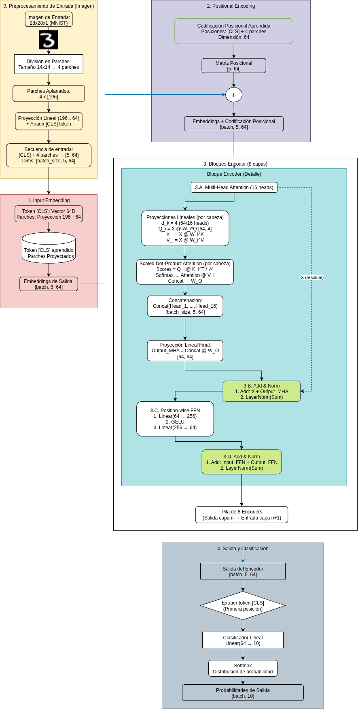

# Vision Transformer

## Estructura del Proyecto

A continuación se muestra la estructura de directorios del proyecto:

```
.
├── app
│   └── main.cpp
├── CMakeLists.txt
├── compile\_commands.json
├── data
│   ├── fashion\_test.csv
│   ├── fashion\_train.csv
│   ├── mnist\_test.csv
│   └── mnist\_train.csv
├── include
│   ├── activations
│   │   ├── GELU.hpp
│   │   └── ReLU.hpp
│   ├── core
│   │   └── Tensor.hpp
│   ├── layers
│   │   ├── Dense.hpp
│   │   ├── Embeddings.hpp
│   │   ├── FeedForward.hpp
│   │   ├── Layer.hpp
│   │   ├── LayerNorm.hpp
│   │   ├── MultiHeadAttention.hpp
│   │   └── PatchEmbedding.hpp
│   ├── losses
│   │   ├── CrossEntropy.hpp
│   │   └── Loss.hpp
│   ├── model
│   │   ├── Trainer.hpp
│   │   ├── TransformerEncoderBlock.hpp
│   │   └── VisionTransformer.hpp
│   ├── optimizers
│   │   ├── Adam.hpp
│   │   ├── Optimizer.hpp
│   │   └── SGD.hpp
│   └── utils
│   │   ├── DataReader.hpp
│   │   └── ModelUtils.hpp
├── README.md
├── run.sh
└── src
├── activations
│   ├── GELU.cpp
│   └── ReLU.cpp
├── core
│   └── Tensor.cpp
├── layers
│   ├── Dense.cpp
│   ├── Embeddings.cpp
│   ├── FeedForward.cpp
│   ├── LayerNorm.cpp
│   ├── MultiHeadAttention.cpp
│   └── PatchEmbedding.cpp
├── losses
│   └── CrossEntropy.cpp
├── model
│   ├── Trainer.cpp
│   ├── TransformerEncoderBlock.cpp
│   └── VisionTransformer.cpp
├── optimizers
│   └── Adam.cpp
└── utils
├── DataReader.cpp
└── ModelUtils.cpp

```

## Instrucciones para ejecutar el proyecto

### 1. Clonar repositorio, Descargar y descomprimir los datos

```bash
git clone https://github.com/PaulParizacaMozo/VisionTransformer.git
cd VisionTransformer
```

El proyecto utiliza un archivo comprimido llamado `data.zip` que contiene los conjuntos de datos necesarios para la ejecución (Fashion MNIST y MNIST).

1. Descarga el archivo `data.zip` desde el repositorio.
2. Descomprime el archivo `data.zip` en el directorio raíz de tu proyecto. Esto creará un directorio `data` que contiene los siguientes archivos CSV:
   - `fashion_test.csv`
   - `fashion_train.csv`
   - `mnist_test.csv`
   - `mnist_train.csv`

```bash
wget https://github.com/PaulParizacaMozo/VisionTransformer/releases/download/data/data.zip
7z x data.zip
```

### 2. Preparar el script `run.sh`

Antes de ejecutar el script, asegúrate de darle permisos de ejecución:

```bash
chmod +x run.sh
```

### 3. Ejecutar el proyecto

- Para ejecutar el entrenamiento:

```bash
./run.sh
```

- Para testear el modelo en el conjunto de pruebas:

```bash
./run.sh test
```

- Para testear el modelo con una imagen aleatoria `.png`:

```bash
./run.sh image data/7.png
```

- Para ejecutar el visualizador en tiempo real:

```bash
./run.sh visualizer
```

Este script compilará y ejecutará el proyecto. Los datos de entrada se leerán desde el directorio `data`.

---

Este proyecto implementa una arquitectura Vision Transformer (ViT) desde cero en C++, diseñada para clasificación de imágenes en conjuntos de datos como MNIST, FashionMNIST y BloodMNIST. La implementación sigue los principios fundamentales de los Transformers adaptados a datos de imagen.

## Arquitectura del Modelo

### Diagrama de la Arquitectura



### Componentes Principales

#### 1. Preprocesamiento de Entrada (Imagen)

- **Entrada**: Imágenes 28x28 píxeles (1 canal para MNIST)
- **División en parches**:
  - Tamaño de parche: 14x14
  - Parches generados: 4 (28/14 × 28/14)
- **Token [CLS]**:
  - Vector especial añadido al inicio de la secuencia
  - Dimensión: 64 (igual que los embeddings)
- **Proyección lineal**:
  - Cada parche (196 píxeles) → vector de 64 dimensiones

#### 2. Input Embedding

- **Embeddings de parches**:
  - Proyección lineal de 196 → 64 dimensiones
- **Token [CLS]**:
  - Vector aprendido de 64 dimensiones
- **Secuencia de salida**:
  - Formato: `[batch_size, 5, 64]` (1 token CLS + 4 parches)

#### 3. Positional Encoding

- **Codificación posicional**:
  - Embeddings aprendidos para cada posición
  - 5 posiciones: [CLS] + 4 parches
- **Suma con embeddings**:
  - `Embeddings + Positional Encodings`
  - Salida: `[batch_size, 5, 64]`

#### 4. Bloques Encoder (8 capas)

Cada bloque contiene:

##### 3.A. Multi-Head Attention (16 cabezas)

- **Proyecciones lineales**:
  - Entrada dividida en 16 cabezas (dimensión por cabeza = 4)
  - `Q_i = X @ W_i^Q`, `K_i = X @ W_i^K`, `V_i = X @ W_i^V`
- **Scaled Dot-Product Attention**:
  - `Scores = (Q_i @ K_i^T) / √d_k`
  - Softmax → Atención ponderada
- **Concatenación y proyección**:
  - `Concat(Head_1, ..., Head_16)`
  - `Output_MHA = Concat @ W_O`

##### 3.B. Add & Norm

- Conexión residual + Layer Normalization
- `LayerNorm(X + Output_MHA)`

##### 3.C. Position-wise FFN

- **MLP de 2 capas**:
  1. `Linear(64 → 256)` + activación GELU
  2. `Linear(256 → 64)`
- Dropout (20%)

##### 3.D. Add & Norm

- Conexión residual + Layer Normalization
- `LayerNorm(Input_FFN + Output_FFN)`

#### 5. Salida y Clasificación

- **Extracción del token [CLS]**:
  - Primera posición de la secuencia (`índice=0`)
  - Vector de 64 dimensiones
- **Clasificador lineal**:
  - `Linear(64 → 10)` (10 clases para MNIST)
- **Softmax**:
  - Distribución de probabilidad sobre las clases

## Hiperparámetros Configurables

| Parámetro | Valor | Descripción |
|-----------|-------|-------------|
| `embedding_dim` | 64 | Dimensión de los embeddings |
| `num_layers` | 8 | Número de bloques encoder |
| `num_heads` | 16 | Cabezas de atención multi-head |
| `patch_size` | 14 | Tamaño de los parches (14×14) |
| `mlp_hidden_dim` | 256 | Dimensión oculta en FFN |
| `dropout_rate` | 0.2 | Tasa de dropout |
| `batch_size` | 64 | Tamaño del lote |
| `learning_rate` | 3e-4 | Tasa de aprendizaje |
| `weight_decay` | 1e-4 | Decaimiento de pesos |

## Compilación y Ejecución

### Configuración de datos

1. Descargar conjuntos de datos MNIST en formato CSV
2. Colocar en directorio `data/`:
   - `mnist_train.csv`
   - `mnist_test.csv`

## Flujo de Entrenamiento

1. **Carga de datos**:
   - Lectura de imágenes y etiquetas desde CSV
   - Normalización: media=0.1307, desviación=0.3081

2. **Preprocesamiento**:
   - División en parches
   - Creación de tokens [CLS]
   - Proyección lineal a embeddings

3. **Entrenamiento**:
   - Forward pass a través de los 8 bloques encoder
   - Extracción del token [CLS]
   - Clasificación lineal + softmax
   - Cálculo de pérdida (cross-entropy)
   - Backpropagation y optimización (AdamW)

4. **Evaluación**:
   - Validación después de cada época
   - Cálculo de precisión en conjunto de validación

5. **Guardado del modelo**:
   - Pesos en formato binario (`vit_mnist.weights`)
   - Configuración en JSON (`vit_mnist.json`)

## Personalización

Para usar con otros conjuntos de datos:

```cpp
ViTConfig model_config;
model_config.embedding_dim = 128;   // Aumentar dimensión
model_config.num_classes = 10;      // Para datasets con más clases
model_config.in_channels = 3;        // Para imágenes RGB (BloodMNIST)
```

## Resultados Esperados

- **MNIST**:
  - Accuracy >90% en alrededor de 10 épocas

- **FashionMNIST**:
  - Accuracy >85% en alrededor de 20 épocas

- **BloodMNIST** (imágenes 3x28x28):
  - Accuracy ~75-80% en alrededor de 30 épocas
